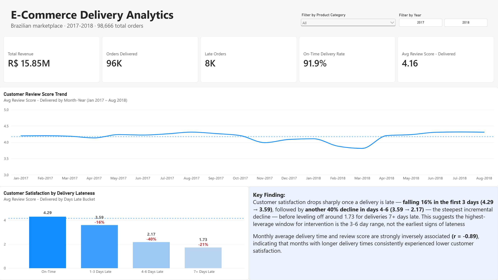
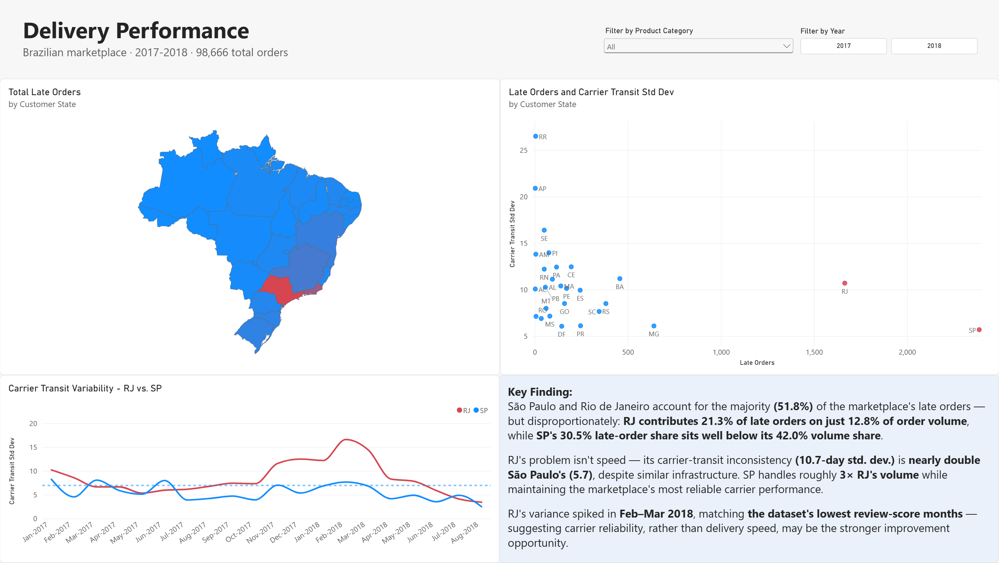
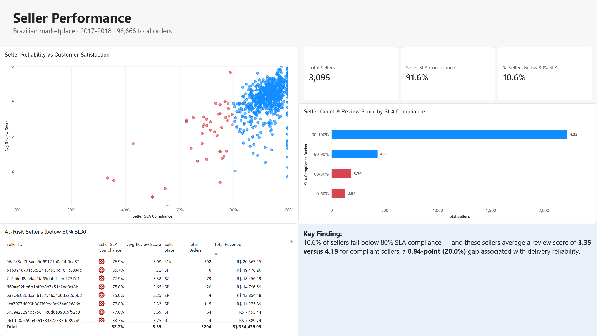
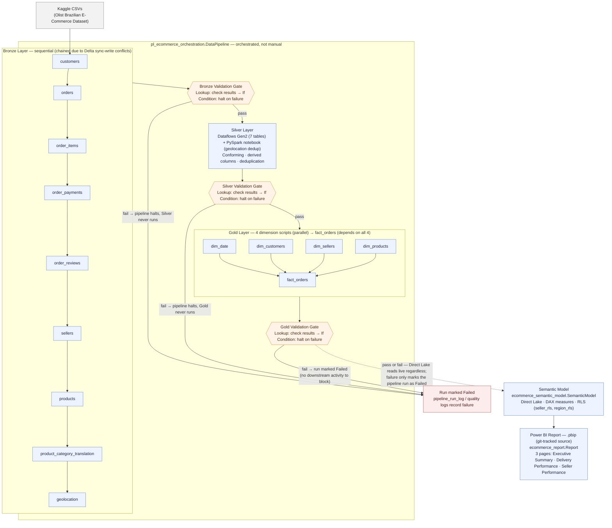
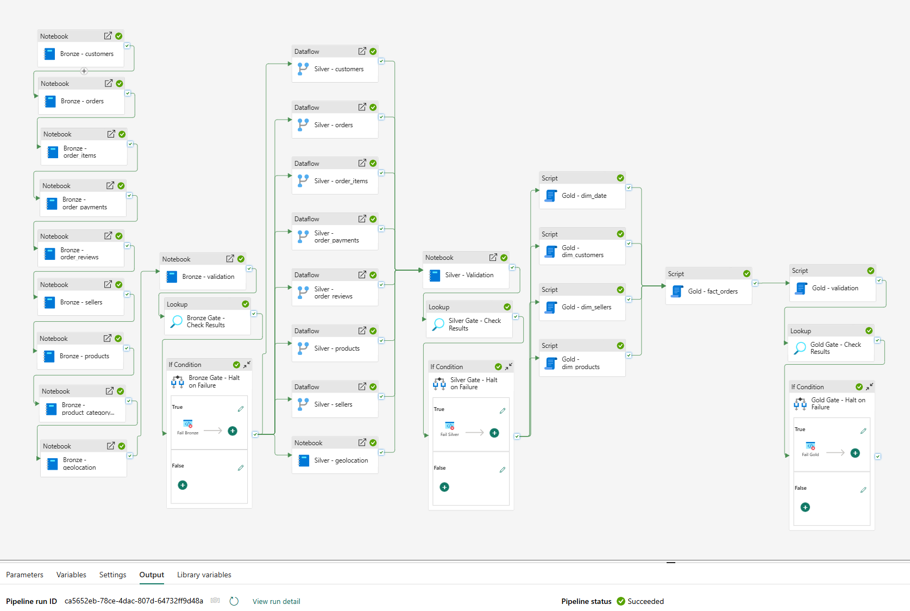
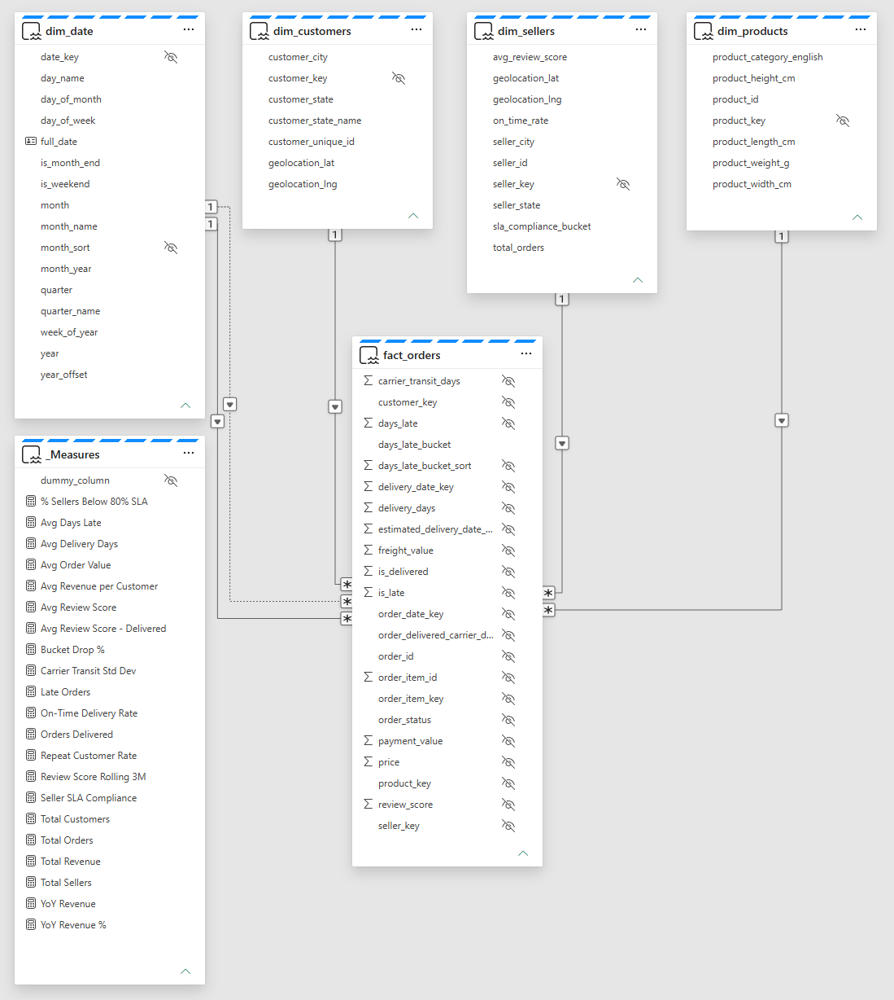

# E-Commerce Delivery Analytics Platform

> **Business Problem:**
>
> What delivery and seller factors drive customer dissatisfaction in a Brazilian e-commerce marketplace?
>
> Can we identify which regions and seller segments are responsible for the highest rates of delayed deliveries and negative reviews?

---

## Key Findings

- **Late deliveries drive dissatisfaction.** Review scores fall 16% in the first 1–3 days late, then drop a further 40% from that already-lower level in days 4–6 (a ~49% cumulative decline from the on-time baseline), before largely leveling off by day 7.
- **Rio de Janeiro (RJ) is disproportionately unreliable — not just high-volume.** RJ generates 21.3% of all late deliveries on just 12.8% of order volume. The cause is carrier-transit inconsistency (10.7-day std. dev.), nearly double São Paulo's (5.7), despite São Paulo handling ~3x RJ's order volume.
- **10.6% of sellers carry outsized reputational risk.** Sellers below an 80% on-time delivery standard average a 3.35 review score vs. 4.19 for compliant sellers — a 0.84-point (20%) gap tied directly to delivery reliability.

📄 **[Executive Recommendation Memo (PDF)](exports/executive_memo.pdf)** — 1-page, non-technical summary for leadership

📊 **[Full Report (PDF)](exports/ecommerce_analytics_report.pdf)** — all 3 pages, view without Power BI installed

---

## Report Pages

**Executive Summary**

**Delivery Performance**

**Seller Performance**

---

## Architecture

Full medallion architecture (Bronze → Silver → Gold) on Microsoft Fabric, orchestrated end-to-end and ending in a Direct Lake semantic model and Power BI report.

---

## Pipeline

Orchestrated via a Data Factory pipeline (Notebook → Validation → Dataflow → Validation → Gold SQL activities → Validation, with explicit dependency and success conditions) rather than run manually step-by-step.

---

## Data Model

---

## Tech Stack

| Tool                            | Purpose                                           | Cert Demonstrated |
| ------------------------------- | ------------------------------------------------- | ----------------- |
| Microsoft Fabric (Data Factory) | Pipeline orchestration, incremental loads         | DP-700            |
| PySpark + Delta Lake            | Bronze ingestion, Silver deduplication            | DP-700            |
| Fabric Notebook Validation Gate | Enforced Bronze→Silver data-quality gate          | DP-700            |
| Dataflows Gen2                  | Silver conforming layer                           | DP-600            |
| T-SQL (Fabric Warehouse)        | Gold star schema DDL                              | DP-600            |
| Semantic Model (Direct Lake)    | BI layer, DAX measures, RLS                       | DP-600 / PL-300   |
| Power BI (.pbip)                | Final reporting layer, Git-diffable report format | PL-300            |
| GitHub Actions                  | CI/CD — SQL linting                               | —                 |

**Certifications:** [PL-300](https://learn.microsoft.com/en-us/users/michaelhoover-2613/credentials/9c0581e743fc1bf9) ✅ Passed · [DP-600](https://learn.microsoft.com/en-us/users/michaelhoover-2613/credentials/fa6879dec0a2a917) ✅ Passed · [DP-700](https://learn.microsoft.com/en-us/users/michaelhoover-2613/credentials/365699f83003135b) ✅ Passed

---

## Progress Tracker

- [x] Phase 0 — Setup, scaffold, business case, data dictionary
- [x] Phase 1 — Bronze layer (incremental ingestion, pipeline logging, schema drift, watermark logic)
- [x] Phase 2 — Silver layer (Dataflows Gen2, PySpark validation)
- [x] Phase 3 — Gold layer (T-SQL star schema, Kimball modeling)
- [x] Phase 4 — Orchestration pipeline, fail-fast validation gates, incremental loading
- [x] Phase 5 — Semantic Model, Direct Lake, DAX library
- [x] Phase 6 — Power BI report (3 pages, `.pbip` format)
- [ ] Phase 7 — Export, README final, executive memo, publish

---

_Built by Michael Hoover · [linkedin.com/in/michael-hoover-365data](https://linkedin.com/in/michael-hoover-365data) · [github.com/hoover180](https://github.com/hoover180)_
