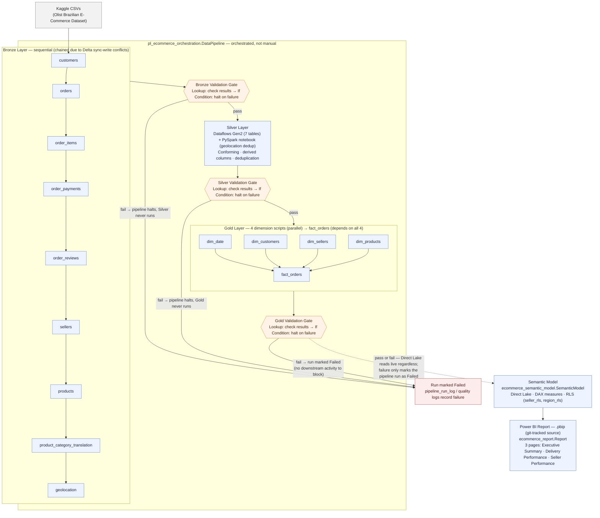

# E-Commerce Delivery Analytics Platform

[](https://github.com/hoover180/ecommerce-analytics/actions/workflows/sql_lint.yml)

> **Business Problem:**
>
> What delivery and seller factors drive customer dissatisfaction in a Brazilian e-commerce marketplace?
>
> Can we identify which regions and seller segments are responsible for the highest rates of delayed deliveries and negative reviews?

---

## Key Findings

- **Late deliveries drive dissatisfaction.** Review scores fall 16% in the first 1–3 days late, then drop a further 40% from that already-lower level in days 4–6 (a ~49% cumulative decline from the on-time baseline), before largely leveling off by day 7.
- **Rio de Janeiro (RJ) is disproportionately unreliable — not just high-volume.** RJ generates 21.3% of all late deliveries on just 12.8% of order volume. The cause is carrier-transit inconsistency (10.7-day std. dev.), nearly double São Paulo's (5.7), despite São Paulo handling ~3x RJ's order volume.
- **10.6% of sellers carry outsized reputational risk.** Sellers below an 80% on-time delivery standard average a 3.35 review score vs. 4.19 for compliant sellers — a 0.84-point (20%) gap tied directly to delivery reliability.

📄 **[Executive Recommendation Memo (PDF)](exports/executive_memo.pdf)** — 1-page, non-technical summary for leadership

📊 **[Full Report (PDF)](exports/ecommerce_analytics_report.pdf)** — all 3 pages, view without Power BI installed

---

## Report Pages

**Executive Summary**


**Delivery Performance**


**Seller Performance**


---

## Architecture

Full medallion architecture (Bronze → Silver → Gold) on Microsoft Fabric, orchestrated end-to-end and ending in a Direct Lake semantic model and Power BI report.



---

## Pipeline

Orchestrated via a Data Factory pipeline (Notebook → Validation → Dataflow → Validation → Gold SQL activities → Validation, with explicit dependency and success conditions) rather than run manually step-by-step.


---

## Data Model

Kimball star schema — one fact table (`fact_orders`, order-item grain) surrounded by four dimensions (`dim_date`, `dim_customers`, `dim_sellers`, `dim_products`), read live via Direct Lake over the `[Gold]` schema. Surrogate keys and raw fact columns with a corresponding DAX measure are hidden from the field list, so users interact with validated measures rather than raw aggregations. `dim_date` is a role-playing dimension — `order_date_key` is the active relationship, with an inactive `delivery_date_key` relationship activated via `USERELATIONSHIP()` where needed. `_Measures` is a placeholder table holding all 21 DAX measures, since Direct Lake doesn't reliably support DAX-defined calculated tables.


---

## DAX Measures Highlights

Some measures that demonstrate semantic modeling depth. Full library: [`/docs/dax_measures_library.md`](docs/dax_measures_library.md)

**Total Revenue** — Solves the fan-out problem on an item-grain fact table. `payment_value` is order-level; summing directly overcounts on multi-item orders. Deduplicates at `order_id` before aggregating, using `SUMX(VALUES(...), CALCULATE(MAX(...)))` rather than `SUMMARIZE` — the more current DAX idiom, since `SUMMARIZE` for adding aggregated columns is generally discouraged in favor of context-transition patterns:

```dax
Total Revenue =
SUMX(
    VALUES(fact_orders[order_id]),
    CALCULATE(MAX(fact_orders[payment_value]))
)
```

Validated against `gold_quality_log` — both return **R$15,846,280.17**, 0% variance.

---

**Bucket Drop %** — Dynamically looks up each lateness bucket's _immediately preceding_ bucket and computes the percentage change against it, rather than a fixed comparison point:

```dax
Bucket Drop % =
VAR CurrentScore = [Avg Review Score - Delivered]
VAR PreviousBucket =
    SWITCH(
        SELECTEDVALUE(fact_orders[days_late_bucket]),
        "1-3 Days Late", "On-Time",
        "4-6 Days Late", "1-3 Days Late",
        "7+ Days Late", "4-6 Days Late",
        BLANK()
    )
VAR PreviousScore =
    CALCULATE(
        [Avg Review Score - Delivered],
        REMOVEFILTERS(
            fact_orders[days_late_bucket],
            fact_orders[days_late_bucket_sort]
        ),
        fact_orders[days_late_bucket] = PreviousBucket
    )
RETURN
    DIVIDE(CurrentScore - PreviousScore, PreviousScore)
```

`REMOVEFILTERS` has to clear `days_late_bucket` _and_ its sort-helper column together — clearing only one leaves the other pinned to the current row, producing an impossible filter combination and a silent `BLANK()` instead of the intended prior-bucket score.

---

**% Sellers Below 80% SLA** — Denominator restricted to sellers with a measurable `on_time_rate`, not all sellers:

```dax
% Sellers Below 80% SLA =
DIVIDE(
    CALCULATE(DISTINCTCOUNT(dim_sellers[seller_id]), dim_sellers[sla_compliance_bucket] IN {"0-60%", "60-80%"}),
    CALCULATE(DISTINCTCOUNT(dim_sellers[seller_id]), NOT ISBLANK(dim_sellers[on_time_rate]))
)
```

125 of 3,095 sellers have zero delivered orders and a correctly-`NULL` `on_time_rate` — they can never land in the below-80% numerator, but would silently dilute the percentage downward if left in the denominator. Restricting both sides to the same measurable population keeps the stat honest.

**Validated: 10.6%** (315 of 2,970 measurable sellers) — the seller-reliability finding behind the Seller Performance page and executive memo.

---

## Tech Stack

| Tool                            | Purpose                                           | Cert Demonstrated |
| ------------------------------- | ------------------------------------------------- | ----------------- |
| Microsoft Fabric (Data Factory) | Pipeline orchestration, incremental loads         | DP-700            |
| PySpark + Delta Lake            | Bronze ingestion, Silver deduplication            | DP-700            |
| Fabric Notebook Validation Gate | Enforced Bronze→Silver data-quality gate          | DP-700            |
| Dataflows Gen2                  | Silver conforming layer                           | DP-600            |
| T-SQL (Fabric Warehouse)        | Gold star schema DDL                              | DP-600            |
| Semantic Model (Direct Lake)    | BI layer, DAX measures, RLS                       | DP-600 / PL-300   |
| Power BI (.pbip)                | Final reporting layer, Git-diffable report format | PL-300            |
| GitHub Actions                  | CI/CD — SQL linting                               | —                 |

**Certifications:** [PL-300](https://learn.microsoft.com/en-us/users/michaelhoover-2613/credentials/9c0581e743fc1bf9) ✅ Passed · [DP-600](https://learn.microsoft.com/en-us/users/michaelhoover-2613/credentials/fa6879dec0a2a917) ✅ Passed · [DP-700](https://learn.microsoft.com/en-us/users/michaelhoover-2613/credentials/365699f83003135b) ✅ Passed

---

📓 **[Bronze Ingestion Notebooks](notebooks/)** — PySpark, watermark-based incremental loads, schema drift detection

🗂️ **[SQL Showcase](gold/sql/)** — Kimball star schema DDL, surrogate key logic, validation scripts

---

## Data Quality Framework

Every layer of this pipeline includes automated validation, enforced by
fail-fast gates rather than checks that merely log and continue: Bronze
validation confirms row counts against true source counts, PK nulls,
duplicates, and date ranges; Silver validation adds row-count parity
against Bronze, referential integrity, and derived-column sanity checks;
Gold validation covers surrogate-key completeness, referential integrity,
fact-table row-count parity, and a revenue reconciliation confirmed at
**0% variance** (`fact_orders` vs. `Silver.order_payments`, both
**R$15,846,280.17**). A failure at Bronze or Silver halts the pipeline
before the next layer runs — tested against a deliberate schema-drift
failure to confirm it actually blocks downstream execution, not just logs
a warning. The Gold gate behaves slightly differently: since it's the
pipeline's last activity, a failure marks the run as Failed but can't
block Direct Lake from serving whatever's already in the Gold tables — a
known limitation of gating the final stage of a live-read model, not an
oversight.

Full validation scripts: [`/gold/sql/validation/`](gold/sql/validation/).

---

## Lessons Learned

- **Pipeline activities embed SQL as static text — they don't reference the repo.** Fabric Data Factory Script activities store their SQL directly in the pipeline's own definition, not as a pointer to `/gold/sql/*.sql`. Three scripts silently drifted from what was committed after later fixes (a column rename, a boundary-logic correction, two new columns) were made against the Warehouse but never re-pasted into the pipeline. Found by comparing the pipeline's JSON against git rather than assuming a green run meant current code — a full pipeline run had actually succeeded while running stale logic.

- **A CSV parsing bug was silently dropping 3.9% of reviews.** Spark's default CSV reader was splitting `order_reviews`' multiline comment text into broken rows, which then read as null values and got excluded — 95,330 of 99,224 true rows, misdiagnosed at the time as a null-date data-quality gap rather than a parsing defect. Fixed with explicit `multiLine`/`quote`/`escape` read options; row count now matches Kaggle's true count exactly.

- **A watermark bug worked by coincidence, not correctness.** Incremental loads wrote `date.today()` to the watermark instead of the max business timestamp from the rows actually loaded — harmless only because the dataset is static and today's date is always later than any real order timestamp. Fixed to compute the true max timestamp from loaded rows, gated so a 0-row run leaves the watermark untouched rather than writing a meaningless value. Verified live with two tests: a real no-op run (watermark correctly unchanged) and a synthetic-row injection (watermark correctly advanced to the injected rows' max date, not today's).

---

## Future Enhancements

- **Parameterized Bronze ingestion.** 9 near-identical notebooks (one per table) could collapse into a single parameterized notebook driven by a `ForEach` pipeline activity. The original sync-write conflict was concurrent writes to the shared `pipeline_run_log` table — Delta's optimistic concurrency control rejected simultaneous `INSERT`s from parallel notebook runs, not a conflict in the actual per-table Bronze writes (`Bronze.customers`, `Bronze.orders`, etc. are independent Delta tables and don't contend with each other). A more sophisticated redesign would let the genuinely independent per-table ingestion run in true parallel, while consolidating the `pipeline_run_log` write into a single downstream step that batches all 9 notebooks' results — turning 9 concurrent writers into 1, rather than serializing the whole pipeline to avoid contention at a single shared table.
- **Split `fact_orders` into order-grain and item-grain facts.** The current table carries order-level attributes (`payment_value`, `review_score`, `delivery_days`) at item grain, requiring a `VALUES(order_id)`-based de-fan-out pattern across most DAX measures. A production redesign would separate these, simplifying the DAX library at the cost of a fact-to-fact relationship. Documented as a deliberate scope trade-off rather than an oversight.
- **RLS security-mapping table.** `seller_rls` and `region_rls` currently demonstrate the RLS mechanism (`USERPRINCIPALNAME() = [state]`) but aren't production-ready, since a login UPN will never equal a state code. A real implementation would join through a user-email-to-authorized-state mapping table. `Test as Role` couldn't be validated live in this trial workspace due to an SSO limitation — filter logic was instead verified via DAX query view. A real mapping table was deferred for the same reason: without live `Test as Role` access in this environment, there was no reliable way to validate end-to-end user-level enforcement, so the pattern-demo version was kept and labeled honestly rather than built out further.
- **Hash-based change detection for full-replace tables.** The 6 full-replace Bronze tables have no natural timestamp to incrementally filter on. At production scale, hashing each row's non-key columns and writing only on a diff would reduce write volume — not implemented here given these tables' small, static size at this project's scale.
- **Import-mode semantic model snapshot.** Direct Lake requires an active Fabric capacity to serve data; a converted Import-mode copy would preserve a fully queryable, standalone `.pbix` independent of the trial workspace's lifetime.

---

## Progress Tracker

- [x] Phase 0 — Setup, scaffold, business case, data dictionary
- [x] Phase 1 — Bronze layer (incremental ingestion, pipeline logging, schema drift, watermark logic)
- [x] Phase 2 — Silver layer (Dataflows Gen2, PySpark validation)
- [x] Phase 3 — Gold layer (T-SQL star schema, Kimball modeling)
- [x] Phase 4 — Orchestration pipeline, fail-fast validation gates, incremental loading
- [x] Phase 5 — Semantic Model, Direct Lake, DAX library
- [x] Phase 6 — Power BI report (3 pages, `.pbip` format)
- [x] Phase 7 — Export, README final, executive memo, publish

---

_Built by Michael Hoover · [linkedin.com/in/michael-hoover-365data](https://linkedin.com/in/michael-hoover-365data) · [github.com/hoover180](https://github.com/hoover180)_
